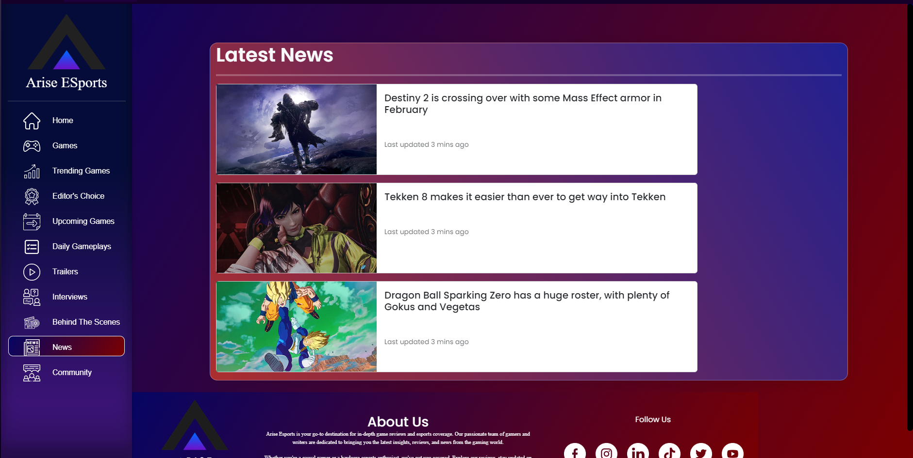

# Arise Game Review Website

This is my first website project and also this is our first website project in school at 2nd year college.
Finished - February 13, 2024

Main Programmer/Developer
    -John Adrian D. Bonto

Other Members of my group :
    -Andal, Harley Dave
    -Curzon, Ronald
    -Basi, Mark Peneil
    -Parajes, John Michael

CREDITS/SPECIAL THANKS TO :
-CDN Links for images
-Steam - https://steamcommunity.com
-IGN - https://www.ign.com/reviews/games
-APK Award - https://apkaward.com
-Google for pictures
-YouTube / YouTubers for the videos
And other gaming review website which i copy the layout and content (Game reviews,Videos) of their website .

Youtube Web Development Tutorials that i watched (HTML,CSS,Javascript)
SuperSimpleDev - https://www.youtube.com/@SuperSimpleDev
SuperSimpleDev (HTML CSS) (6 HOURS) - https://www.youtube.com/watch?v=G3e-cpL7ofc&t=21591s
SuperSimpleDev (Javascript) (22 HOURS) - https://www.youtube.com/watch?v=SBmSRK3feww

TOOLS :
    -https://www.flaticon.com
    -https://css.glass
    -https://cssgradient.io
    -https://getcssscan.com/css-box-shadow-examples
    -https://chat.openai.com

# Page Overview

